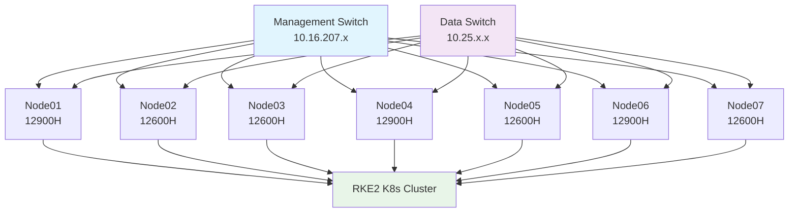

<!--
---
title: "Proxmox-Astronomy-Lab Organization"
description: "Astronomical research computing platform designed as a skill multiplier laboratory, implementing enterprise-grade infrastructure for open science and reproducible research workflows"
author: "[Human Author Name]"
ai_contributor: "Anthropic Claude 4 Sonnet (claude-4-sonnet-20250514)"
date: "2025-07-15"
version: "1.0"
status: "Published"
tags:
- type: organizational-overview
- domain: astronomical-computing
- tech: proxmox-kubernetes-enterprise
- compliance: cis-controls
- scale: production-infrastructure
related_documents:
- "Platform Documentation Repository"
- "Research Project Repositories"
- "Centralized Documentation Strategy"
---
-->

# Proxmox-Astronomy-Lab Organization


**Astronomical research computing platform designed as a skill multiplier laboratory**

## 🔭 Mission

The Proxmox-Astronomy-Lab organization develops enterprise-grade astronomical research computing infrastructure that creates cascading skill development across systems engineering, DevOps, security, automation, machine learning, and AI. Every infrastructure decision drives research capability, which informs better automation, which teaches deeper technical skills - creating an upward spiral of capability that makes us better researchers, engineers, and scientists.

Our work focuses on computational analysis of high-quality public astronomical datasets, positioning for upcoming surveys like Vera Rubin Observatory while building reproducible workflows that demonstrate how modern enterprise practices enable rather than hinder scientific research.

### 🔭 Core Projects
[](https://github.com/Pxomox-Astronomy-Lab/proxmox-astronomy-lab)
[](https://github.com/Pxomox-Astronomy-Lab/desi-cosmic-void-galaxies)
[](https://github.com/Pxomox-Astronomy-Lab/desi-quasar-outflows)
[](https://github.com/Pxomox-Astronomy-Lab/desi-qso-anomaly-detection)

---

### 🧪 Tech Stack
[](https://www.python.org/)
[](https://www.gnu.org/software/bash/)
[]()
[](https://graphql.org/)

[](https://www.postgresql.org/)
[](https://milvus.io/)
[](https://neo4j.com/)
[](https://www.timescale.com/)
[](https://www.influxdata.com/)
[](https://www.dragonflydb.io/)
[](https://www.mongodb.com/)

[](https://www.langchain.com/)
[](https://github.com/langchain-ai/langgraph)
[]()
[]()
[](https://mlflow.org/)
[](https://ollama.ai/)
[](https://github.com/open-webui/open-webui)

[](https://docs.rke2.io/)
[](https://www.portainer.io/)
[](https://www.docker.com/)

[](https://prometheus.io/)
[](https://grafana.com/)
[](https://grafana.com/oss/loki/)
[](https://prometheus.io/docs/alerting/latest/alertmanager/)

[](https://www.ansible.com/)
[](https://github.com/windmill-labs/windmill)

[](https://www.cisecurity.org/)
[](https://kcnf.io/)
[](https://github.com/aquasecurity/kube-bench)
[](https://tailscale.com/)
[](https://wazuh.com/)

## 🌟 Open Science & Open IT Philosophy

We practice radical transparency in both research and infrastructure development. Every workflow, decision, failure, and success is documented with the intent that our entire approach - from lab architecture to research pipelines - is completely reproducible. This Open Science/Open IT philosophy ensures that:

- **Research methodologies** are fully documented and repeatable
- **Infrastructure configurations** are version-controlled and automated
- **Security implementations** demonstrate enterprise practices in research environments
- **Learning processes** are captured and shared for community benefit

## 🏗️ Platform Architecture

Our production research platform runs on a 7-node Proxmox cluster (144 cores, 700GB RAM) built from MS-A1 small form factor workstations that fit on a closet shelf while delivering enterprise-grade computational capability. The platform implements:

- **Hybrid Kubernetes + VM Architecture**: RKE2 orchestration with strategic static VMs for databases and persistent services
- **Enterprise Security Baseline**: CIS Controls implementation as both security research and operational requirement
- **Secure Remote Access**: Entra E5 hybrid identity with Cloudflare ZTNA for staff and external researcher collaboration
- **Open Source Toolchain**: GitOps automation, container orchestration, and scientific computing workflows

This architecture enables secure, scalable astronomical research while serving as a learning laboratory for modern infrastructure practices.



## 🔬 Current Research & Development

We are actively running research projects on production infrastructure while continuing platform expansion:

### Active Research Projects

**DESI Cosmic Void Analysis** - Our flagship research project focuses on analyzing the large-scale structure of the universe using DESI Data Release 1, specifically examining galaxy populations within cosmic voids. This work involves processing 30GB+ PostgreSQL datasets containing spectroscopic observations of void galaxies, implementing statistical analysis pipelines to understand how galaxy properties correlate with void environments, and developing visualization tools for three-dimensional void mapping. The project demonstrates enterprise-scale data management while contributing to our understanding of structure formation in the universe.

**DESI AGN Outflow Studies** - This project investigates active galactic nucleus outflows through semi-automated spectral fitting techniques combined with Cloudy photoionization modeling. We're developing automated pipelines that can identify and characterize AGN-driven outflows in massive spectroscopic datasets, using machine learning to classify spectral features and systematic modeling to understand the physical conditions of outflowing material. The work advances both astronomical understanding of galaxy evolution and demonstrates sophisticated data processing workflows on our enterprise infrastructure.

**DESI Anomalous Quasar Detection** - Leveraging machine learning for large-scale anomaly detection across millions of quasar spectra in the DESI survey. This project implements distributed computing frameworks using Ray clusters on our Kubernetes infrastructure to process massive datasets, develop 1D convolutional variational autoencoders for spectral analysis, and identify statistically unusual quasars that may represent new physics or rare astrophysical phenomena. The project showcases both AI/ML capabilities and the power of modern infrastructure for scientific discovery.

### Infrastructure Development
- **CIS Baseline Implementation**: Documenting the tension and solutions for running research workloads on security-hardened infrastructure
- **AI-Enhanced Workflows**: Spec-driven development using Claude for accelerated infrastructure automation
- **Enterprise Integration**: Hybrid cloud identity management and secure collaboration frameworks

### Platform Status
- **Production**: 5 nodes operational, running real research workloads
- **Expansion**: 2 additional nodes in transit, targeting full 7-node capacity
- **Documentation**: Comprehensive knowledge base covering all implementations and decisions

## 🤝 Collaboration Opportunities

Our multi-domain approach creates diverse opportunities for collaboration and skill development:

### 🛠️ Systems Engineering & Infrastructure
- Kubernetes optimization for scientific workloads
- Enterprise security implementation in research environments
- Hybrid cloud architecture and identity management
- Infrastructure as Code and GitOps automation

### 🔭 Astronomical Research
- Public dataset analysis and pipeline development
- Large-scale data processing and visualization
- Preparation for Vera Rubin Observatory data access
- Scientific publication and methodology development

### 🔐 Security & Compliance
- CIS Controls implementation and validation
- Research environment threat modeling
- Secure collaboration frameworks
- Zero Trust Network Access for research teams

### 🤖 AI & Automation
- Spec-driven development methodologies
- Agentic coding and infrastructure automation
- Machine learning pipeline development
- AI-enhanced research workflows

### 📚 Documentation & Knowledge Management
- Open Science documentation practices
- Enterprise-grade knowledge base development
- Reproducible research methodology capture
- Technical writing and community engagement

## 📊 Repository Structure

Our organization reflects the multi-tier documentation and development approach:

| Repository | Domain | Purpose | Status |
|------------|--------|---------|--------|
| [proxmox-astronomy-lab](https://github.com/Proxmox-Astronomy-Lab/proxmox-astronomy-lab) | Platform Infrastructure | Core platform documentation and enterprise architecture | Production |
| [desi-cosmic-voids](https://github.com/Proxmox-Astronomy-Lab/desi-cosmic-voids) | Research Project | Cosmic void galaxy analysis using DESI DR1 data | Active Development |
| [desi-agn-outflows](https://github.com/Proxmox-Astronomy-Lab/desi-agn-outflows) | Research Project | AGN outflow semi-automated spectral fitting | Active Development |
| [desi-qad-anomalous-quasars](https://github.com/Proxmox-Astronomy-Lab/desi-qad-anomalous-quasars) | Research Project | Machine learning anomaly detection for quasar spectra | Active Development |
| [spec-driven-ai](https://github.com/Proxmox-Astronomy-Lab/spec-driven-ai) | AI Research | Specification-driven development with Claude integration | Active Development |
| [the-crystal-forge](https://github.com/Proxmox-Astronomy-Lab/the-crystal-forge) | Methodology | RAVGV development methodology and frameworks | Documentation |

## 🔄 Getting Started

1. **Explore Documentation**: Start with our [centralized documentation](https://docs.radioastronomy.io) for comprehensive platform understanding
2. **Choose Your Domain**: Select areas of interest from astronomy, infrastructure, security, or AI/automation
3. **Join Discussions**: Engage in repository discussions and issue tracking for active projects
4. **Contribute Skills**: Submit pull requests, documentation improvements, or research contributions
5. **Collaborate Remotely**: Request access for secure remote research collaboration

All contributions follow our Open Science principles and must align with our commitment to reproducible, well-documented research and infrastructure practices.

## 🔐 Security & Research Ethics

The Proxmox-Astronomy-Lab organization demonstrates how enterprise security practices enhance rather than impede scientific research:

- **CIS Controls Baseline**: Full enterprise security implementation with documented research workflow accommodations
- **Zero Trust Access**: Secure remote collaboration for distributed research teams
- **Open Source Security**: Transparent security implementations and audit capabilities
- **Responsible AI**: Ethical AI practices in both research automation and scientific analysis
- **Data Stewardship**: Proper handling of public datasets with full provenance tracking

## 📢 Community & Documentation

- **Documentation Hub**: [docs.radioastronomy.io](https://docs.radioastronomy.io) - Comprehensive platform and project documentation
- **GitHub Discussions**: Technical discussions, research collaboration, and community support
- **Issue Tracking**: Project-specific development and research milestone tracking
- **Knowledge Base**: Extensive documentation of all workflows, decisions, and implementations

## 📄 Licensing & Reproducibility

All projects operate under open source licenses (primarily MIT) to ensure maximum reproducibility and community benefit. Our commitment to Open Science means that not only are our findings and tools freely available, but our entire infrastructure approach is documented and reproducible.

---

*Building the future of astronomical research through enterprise infrastructure and skill multiplication*
```
